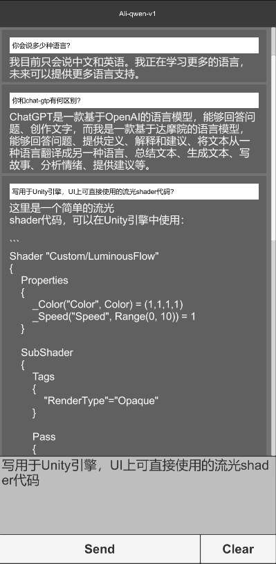

# 简介
- 基于阿里通义千问
- 基于chatgpt
- 实现unity智能编程
- 

# 开发计划
- 生成可执行代码
- 生成UI预制件
- 资源处理
- 

# 参考
- https://help.aliyun.com/zh/dashscope/developer-reference/quick-start?spm=a2c4g.11186623.0.0.fd245fa6VpOixZ
- https://help.aliyun.com/zh/dashscope/developer-reference/api-details-15?spm=a2c4g.11186623.0.0.79ab5fa6ptVsLH